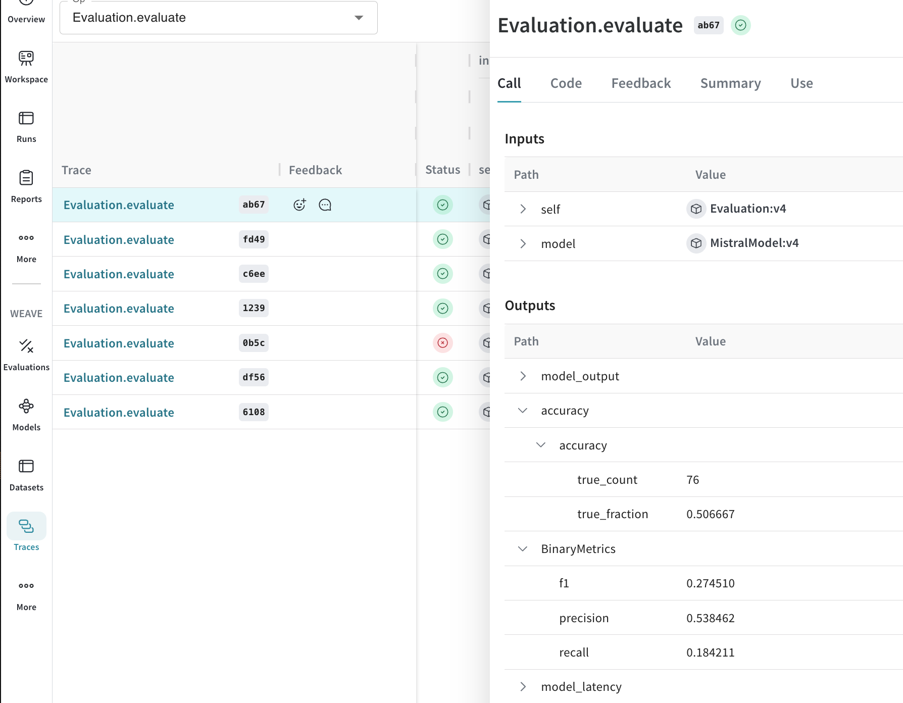

# LLM Judge: Detecting hallucinations in language models

This project demonstrates how to fine-tune and evaluate a Mistral AI language model to detect factual inconsistencies and hallucinations in text summaries. It is based on [this amazing blog post](https://eugeneyan.com/writing/finetuning/) by Eugene Yan.

In this project, we will:

- Prepares datasets from Factual Inconsistency Benchmark (FIB) and USB
- Fine-tunes a Mistral 7B model for hallucination detection
- Evaluates model performance using accuracy, F1 score, precision, and recall
- Integrates with Weights & Biases for experiment tracking

## Weave

In this project we make extensive use of [Weave](https://wandb.github.io/weave) to trace and organize our model evaluations.

- You can get started with Weave and MistralAI by following the [quickstart guide](https://wandb.github.io/weave/guides/integrations/mistral)

## Usage

1. Prepare the data:
   - Run `01_prepare_data.ipynb` to process and format the datasets

   > The dataset is also available in the `data` folder, so you may skip this notebook.

2. Fine-tune and evaluate the model:
   - Run `02_finetune_and_eval.ipynb` to:
     - Evaluate baseline Mistral models (7B and Large)
     - Fine-tune a Mistral 7B model
     - Evaluate the fine-tuned model

## Results

The notebook demonstrates improvements in hallucination detection after fine-tuning, with detailed metrics and comparisons between model versions.

All the results and evaluation are logged to [this Weave Project](https://wandb.ai/capecape/llm-judge-webinar/weave)

The finetuning process is logged to Weights & Biases as well, living together on the [same project](https://wandb.ai/capecape/llm-judge-webinar?nw=nwusercapecape) as the model evals.

## Docs

- Weights & Biases: https://wandb.ai/
- Mistral finetuning docs: https://docs.mistral.ai/capabilities/finetuning/
- Tracing with W&B Weave: https://wandb.me/weave

## Notes

- Ensure you have the necessary API keys for Mistral AI and Weights & Biases
- Adjust `NUM_SAMPLES` in the evaluation notebook to control the number of examples used

For more details, refer to the individual notebooks and comments within the code.